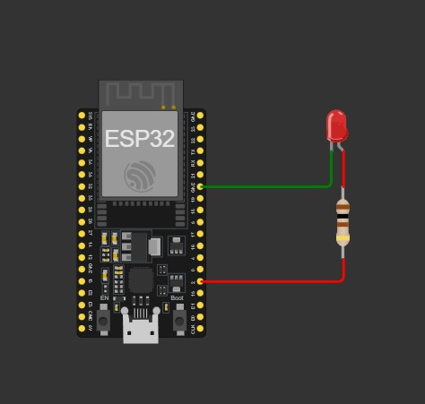

# Integrasi Asisten Virtual (Google Assistant + ESP32 + Blynk)
## 🙋‍♂️ Identitas Mahasiswa

- **Nama  :** Adi Mulyadi  
- **NIM   :** 22552011131  
- **Kelas :** TIF RM 21A

---
Proyek ini memungkinkan pengguna mengontrol lampu (LED) melalui **Google Assistant** yang terhubung ke **Blynk IoT Cloud**, dikendalikan oleh **ESP32**. Proyek ini cocok untuk implementasi **Smart Home** sederhana.

---

## 🎯 Tujuan Proyek

- Mengendalikan LED (lampu) dengan perintah suara dari Google Assistant
- Menghubungkan ESP32 ke Blynk Cloud
- Menjalankan simulasi via [Wokwi IoT Simulator](https://wokwi.com/)

---

## 🔧 Komponen yang Digunakan

- ESP32 Dev Module
- LED
- Resistor 220Ω
- Breadboard & jumper
- Aplikasi Blynk (versi baru)
- Akun IFTTT + Google Assistant

---

## 🖼️ Skema Rangkaian

Berikut skema yang digunakan:

> **Catatan:** Pastikan LED diarahkan dengan benar, kaki panjang (anoda) ke GPIO2, kaki pendek (katoda) ke GND melalui resistor.

---

## 🔗 Simulasi Wokwi

👉 [Klik untuk membuka simulasi](https://wokwi.com/projects/435366827450841089)

---

## 🧠 Cara Kerja Singkat

1. ESP32 terhubung ke jaringan WiFi (`Wokwi-GUEST`)
2. ESP32 tersambung ke **Blynk Cloud** menggunakan `Blynk.begin()`
3. Google Assistant → IFTTT Webhook → Kirim nilai ke Virtual Pin `V0` di Blynk
4. Blynk akan mengubah kondisi `GPIO2` sesuai nilai V0 (0 atau 1)
5. LED menyala atau mati sesuai perintah

---
